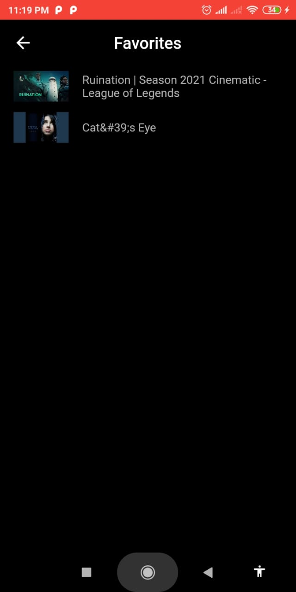
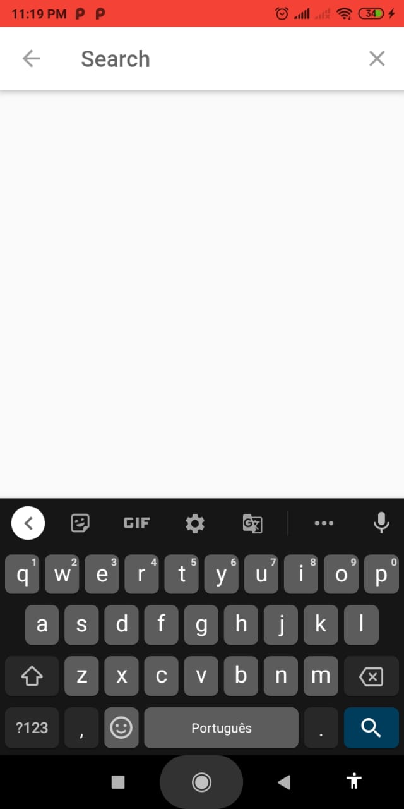
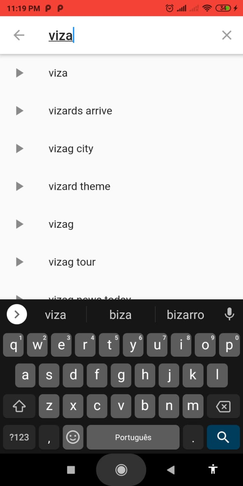
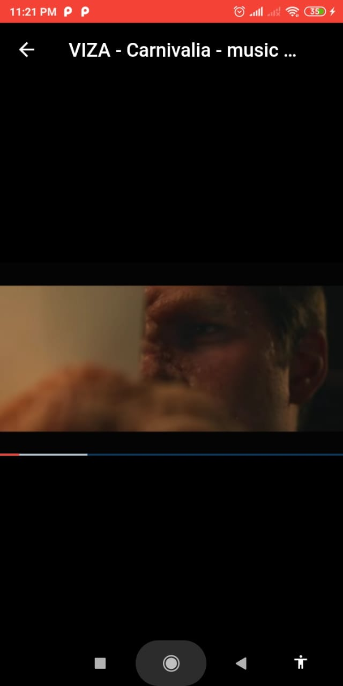

# fluttertube
 App made in flutter, utilizing BLoC Pattern to update the UI (Favorites counter).
 
 In this app you can search a youtube video and add them to favorites and watch them.
 It's a simple project just to use the BloC pattern.
 
## Screens:

## Videos:

